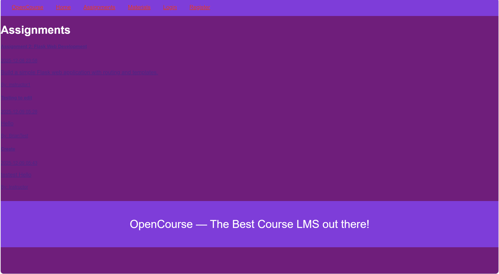
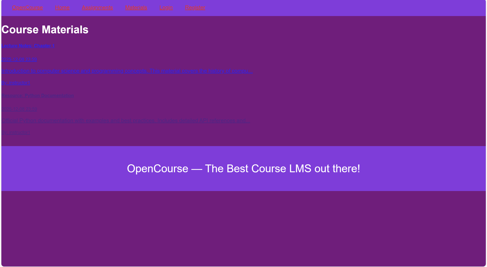
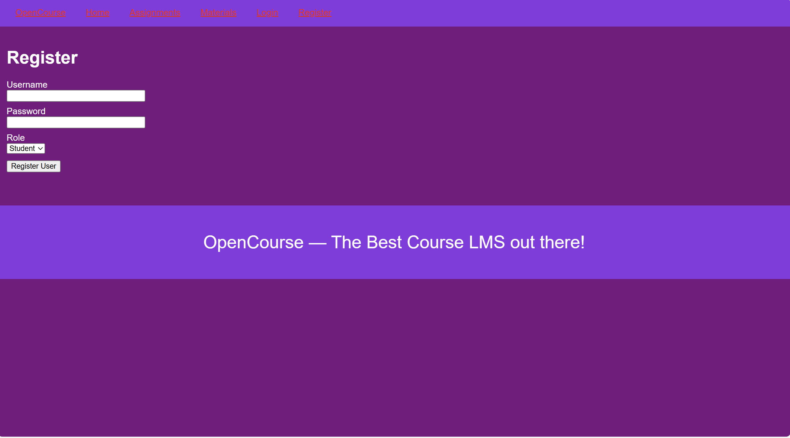
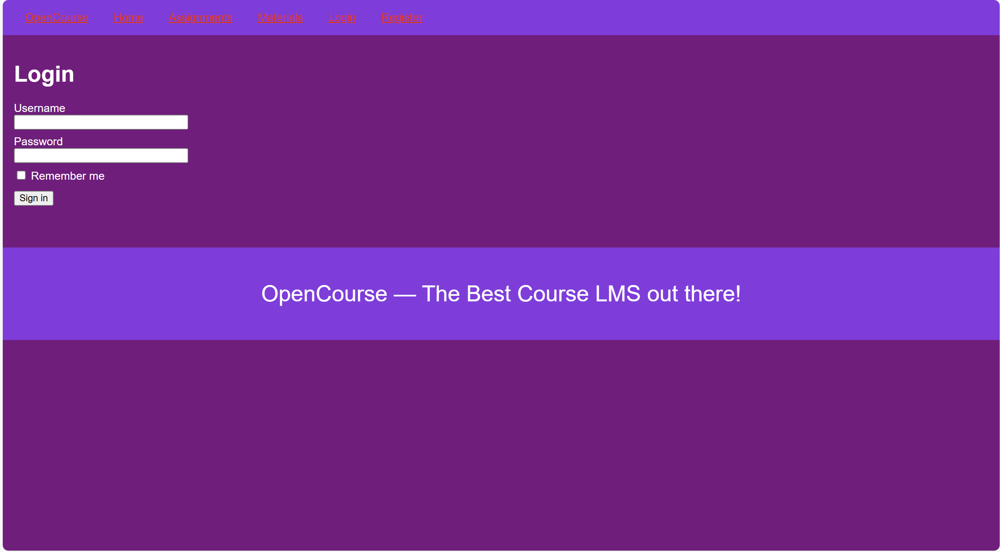

# OpenCourse

Milestone 1 — non-functional Flask-based LMS prototype.

## Installation

1. Create a virtual environment and activate it.

   **Windows (PowerShell):**

   ```powershell
   python -m venv venv
   .\venv\Scripts\Activate
   ```

2. Install all the requirements from requirements.txt

   **Windows (PowerShell):**

   ```powershell
   pip install -r requirements.txt
   ```

3. Run the app

   **Windows (PowerShell):**

   ```powershell
   python run.py
   ```

## Testing Instructions

### 1. Activate the virtual environment

```powershell
venv\Scripts\activate
```

### 2.

```
pytest
```

## Screenshots

1. Home Page
   

2. Assignments Page
   

3. Course Materials Page
   

4.Registration Page


5.Login Page


## Team Roles

Person 1 (Rachel) – Backend Models, Database, Create/Delete Routes
Build SQLAlchemy models, Configure and initialize the database, and implement main entity CRUD routes.

Person 2 (Brian) – Authentication, WTForms, Edit/Update Routes
Create authentication and main entity forms, Implement Flask-Login authentication, and implement edit/update routes for assignments and materials

Person 3 (Sohum) – Unit Testing, Documentation (PDF), README, Tagging
Create tests/ folder structure, Write unit, regression, and implementation tests, create documentation, complete the full README, tag github, final verification for the app to be functional

##Milestone 3 - Final Release

Home Page Logged In 


Home Page Logged Out


Assignments List


Assignment Creation


Testing Results


Test Report

Model Tests
  - These were for User, Assignment, CourseMaterial creation
  - Relationship tests (between instructor and materials)

Form Tests
  - LoginForm validation for:
  - Valid credentials
  - Missing Fields
  - Incorrect Data

Route Tests
  - Public list routes return HTTP 200
  - Protected routes redirect when the user is unauthenticated
  - Instructor-only access is verified

Integration Tests
  - Login is successful
  - Login fails
  - Assignment creation and deletion
  - Material Creation
  - An unauthorized user is attempting to access routes that are protected.

```

```
